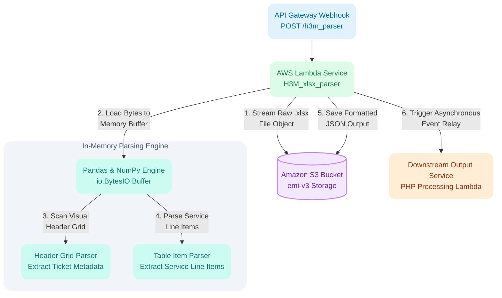

# H3M Field Invoice Excel Parsing Microservice
## Serverless Python Service for High Performance XLSX Processing & Downstream Relay

### Tech Stack & Tools
* **Compute & Infrastructure:** AWS Lambda (Python 3.13), AWS SAM (YAML), Docker (`sam build --use-container`), Amazon API Gateway

* **Core Languages & Libraries:** Python 3.13, NumPy, Pandas (`AWSSDKPandas-Python313` Layer), `openpyxl`, `boto3`

* **Storage & Messaging:** Amazon S3 (`emi-v3` bucket), Asynchronous Lambda to Lambda Relay

---

## Background & Business Problem

H3M provides environmental and field services, maintaining a B2B vendor relationship with EMI (EnterMyInvoice). H3M updated their billing workflow, transitioning field invoice deliveries from standard PDFs into structured `.xlsx` Excel spreadsheets.

Because these spreadsheets arrived through API uploads, EMI needed an automated serverless service to parse incoming files instantly upon arrival:

* Header details like Ticket Number, Client ID, Location, Project, and AFE were scattered across visual form cells rather than standard database tables.

* Line item tables started at variable row offsets depending on the length of description text entered above them.

* Extracted data needed to be formatted into clean JSON, saved to S3 for auditing, and immediately handed off to an existing PHP downstream processing service.

To solve this, I built a serverless Python parsing microservice on AWS. The function handles inbound HTTP payloads, streams target Excel files directly from S3, parses visual headers and line items using NumPy matrix operations, and relays structured JSON payloads to downstream systems.

---

## Solution & Results

I designed and built a lightweight serverless microservice using AWS SAM, Docker, and Python 3.13. The service processes incoming webhook calls from API Gateway, reads Excel spreadsheets straight from S3 into memory buffers, converts messy visual form rows into clean dictionary objects, and triggers downstream execution.

### Key Results

* **Automated Vendor Data Processing:** Replaced manual invoice inspection with an automated Python parser that executes in under a second per file.

* **Zero Disk Write Memory Pipeline:** Streamed raw object bytes directly from S3 into Python `io.BytesIO` buffers, avoiding disk write overhead inside Lambda.

* **Matrix Accelerated Parsing:** Converted DataFrame structures into raw NumPy arrays for fast coordinate lookups and header extraction.

* **Decoupled Architecture:** Extracted data, stored audit JSON files back in S3, and triggered the target PHP processing Lambda asynchronously without blocking the client response.

---

## Architecture & Data Flow

### Pipeline Execution Steps

1. **API Trigger:** API Gateway receives a POST request at `/h3m_parser` containing original file names, S3 attachment keys, and an invocation ID.

2. **File Isolation & Streaming:** The Lambda locates the target `.xlsx` file key, fetches the raw byte object from S3, and loads it into an `io.BytesIO` stream buffer.

3. **Header Metadata Collection:** The parsing engine converts the top eleven rows into a raw NumPy array and scans rightward from known label strings to collect ticket metadata.

4. **Line Item Extraction:** The engine scans remaining rows, identifies table headers by set matching required column names, and maps data rows into clean dictionaries until hitting the total row.

5. **Storage & Downstream Relay:** The script writes the final JSON file back to S3 under the original file stem name and invokes the downstream PHP Lambda asynchronously with the extracted payload.

---

## Engineering Challenges & Solutions

### 1. Fast coordinate lookup in unstructured visual spreadsheets
* **The Challenge:** Header details like Ticket Number, Client ID, Location, and AFE were scattered across arbitrary cells in the top eleven rows. Standard column indexing failed because labels and values shared merged cells across varying columns.

* **The Solution:** Converted the Pandas DataFrame into a raw NumPy array and used `np.argwhere` for fast matrix search. The function locates target label strings and scans rightward across neighboring columns to grab the first non empty value, bypassing fixed column positions entirely.

### 2. Dynamic line item table detection without fixed offsets
* **The Challenge:** Line item tables started on row eighteen or lower depending on supervisor notes. Column order remained constant, but row indices shifted across different workbooks.

* **The Solution:** Built a row scanning loop that checks row contents using set operations. When a row contains all required item header strings (`Line Item Description`, `Name`, `Qty`, `Unit`, `Rate`, `Subtotal`), the parser records exact column positions dynamically. Subsequent rows are parsed using these mapped positions until encountering a `Total` marker row.

### 3. Graceful error handling and Lambda to Lambda relay
* **The Challenge:** If saving the generated JSON to S3 failed due to temporary network issues, the entire pipeline risked crashing before handing data off to downstream systems.

* **The Solution:** Wrapped S3 storage actions in dedicated exception blocks. If S3 storage encounters an issue, the error is logged as a warning, and the pipeline proceeds to invoke the downstream PHP Lambda with the payload in memory, preventing downstream process blocking.

---

## Architectural Reflections & Future Optimizations

While Pandas and NumPy worked well for rapid implementation using the prebuilt AWS SDK Pandas Lambda layer, lighter tools could further reduce cold start times and deployment package sizes in future builds:

* **Pure `openpyxl` or `python-calamine` Parsing:** Replacing Pandas with `openpyxl` alone or Rust backed `python-calamine` would eliminate heavy Pandas and NumPy layer dependencies, reducing memory usage and cold start latency.

* **DuckDB Embedded Queries:** Using DuckDB directly inside Python could allow running SQL queries directly against Excel or Parquet files, handling schema casting and filtering in a single zero footprint engine.
