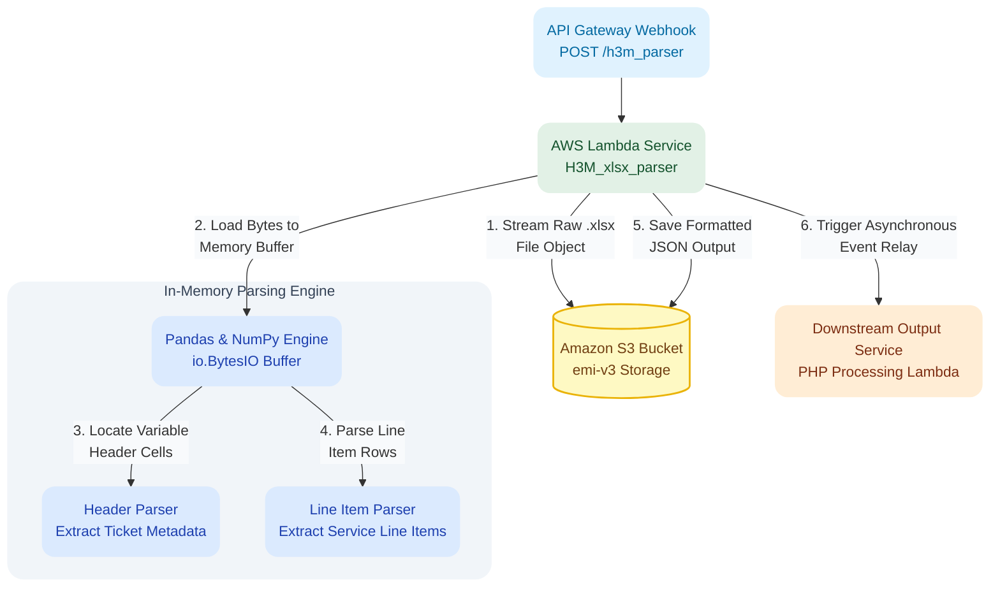

# H3M Field Invoice Parser

A serverless Python microservice on AWS Lambda that parses unstructured `.xlsx` field invoices in memory, converts visual grid headers and line items into clean JSON payloads, and relays data to downstream systems.

---

## Tech Stack

* **Runtime & Compute:** Python 3.13, AWS Lambda, AWS SAM, Amazon API Gateway
* **Data Processing:** NumPy, Pandas (`AWSSDKPandas-Python313` Layer), `openpyxl`, `boto3`
* **Storage & Execution:** Amazon S3 (`emi-v3` bucket), Asynchronous Lambda Invocation
---

## Pipeline Architecture


---

## Parsing & Processing Logic

The service ingests inbound API Gateway webhooks and processes vendor Excel billing sheets through four core execution steps:

* **In-Memory File Streaming:** Fetches target `.xlsx` objects directly from S3 into Python `io.BytesIO` buffers, avoiding local disk write operations inside Lambda.
* **Dynamic Line Item Table Mapping:** Scans rows sequentially using set operations to identify table headers (`Line Item Description`, `Name`, `Qty`, `Unit`, `Rate`, `Subtotal`). The engine dynamically registers column indices and extracts line items regardless of vertical offset until encountering a total row marker.
* **Asynchronous Relay & Output Storage:** Writes the formatted JSON output back to Amazon S3 for auditing and triggers a downstream PHP processing Lambda asynchronously without blocking the client HTTP response.

***Example Output***
```json
{
  "Invoice": {
    "Tax": "4616.27",
    "State": "NM",
    "Terms": "Net 30",
    "AFE_NO": "",
    "County": "Lea",
    "Address": "300 N Marienfeld St. Suite 1000 Midland, TX 79701 USA",
    "Customer": "Permian Resources Operating LLC",
    "Discount": "879.29",
    "Due_Date": "9/13/2026",
    "Rig_Name": "H&P 425",
    "SubTotal": "95527.07",
    "Total_Due": "92545.18",
    "Well_Name": "JOKER 5-8 FED COM 204H",
    "CostCenter": "",
    "Invoice_No": "018-033988",
    "Invoice_Date": "8/14/2026",
    "Net_Subtotal": "87928.91",
    "Requisitioner": [],
    "Reference_No": "SO-018-037096",
    "startDate": "2026-06-21",
    "endDate": "2026-07-29",
    "Item": [
      {
        "Well_Name": "JOKER 5-8 FED COM 204H",
        "Rig_Name": "H&P 425",
        "Spud_Date": "Jun 21, 2026",
        "Rig_Release_Date": "Aug 8, 2026",
        "AFE_Number": "",
        "ITEMID": "104421",
        "Item_Name": "AES WEIGHT I SACK (100)",
        "Quantity": "80",
        "Unit_Price": "13.95",
        "Discount_Percentage": "0.00 %",
        "Discounted_Unit_Price": "13.95",
        "Total_Amount": "1,116.00",
        "Total_Discount": "0.00",
        "Net_Sales_Amount": "1,116.00",
        "Item_Group_Name": "Finished Goods",
        "State_ID": "NM",
        "Billing_Coordinator": "Krystal Mamou",
        "Sales_Taker": "Crystal Alvarez-Urias",
        "Sales_Responsible": "Gabriel Sindelar"
      },
      {
        "Well_Name": "JOKER 5-8 FED COM 204H",
        "Rig_Name": "H&P 425",
        "Spud_Date": "Jun 21, 2026",
        "Rig_Release_Date": "Aug 8, 2026",
        "AFE_Number": "",
        "ITEMID": "104439",
        "Item_Name": "BICARB OF SODA (50)",
        "Quantity": "21",
        "Unit_Price": "24.50",
        "Discount_Percentage": "10.00 %",
        "Discounted_Unit_Price": "22.05",
        "Total_Amount": "514.50",
        "Total_Discount": "51.45",
        "Net_Sales_Amount": "463.05",
        "Item_Group_Name": "Finished Goods",
        "State_ID": "NM",
        "Billing_Coordinator": "Krystal Mamou",
        "Sales_Taker": "Crystal Alvarez-Urias",
        "Sales_Responsible": "Gabriel Sindelar"
      },
      ...
    ]
  }
}
```
